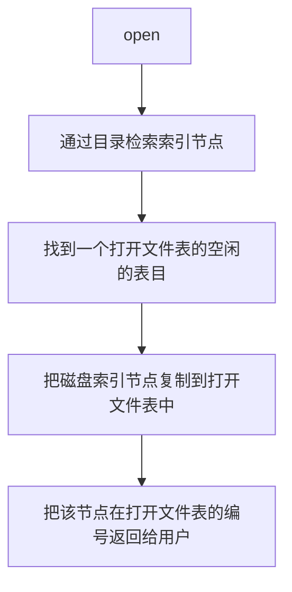

# 文件系统

## 4.1 文件系统基础

### 4.1.1 文件控制块和索引节点

**文件的结构**

1. 数据项
   
   · 基本数据项
   
   · 组合数据项
2. 记录
3. 文件

**文件的属性（文件的元数据）**

1. 名称 **文件的名称是唯一的**
2. 类型
3. 创建者
4. 所有者
5. 位置
6. 大小
7. 保护
8. 创建时间，最后一次修改时间，最后一次存取时间

**文件控制块**

1. 基本信息
2. 存取控制信息
3. 文件的数据块

| 文件控制块 |
| ---- |
| 文件权限（创建，访问，写） |
| 文件所有者，组，ACL |
| 文件大小 |
| 文件数据块 |

**索引节点**

|文件名|索引节点编号|
|----|----|
|文件1||
|文件2||
|.....||

文件名会对应一个索引节点的编号，通过索引节点的编号可以索引到索引节点，索引节点包含了文件描述信息。
在检索文件时将上表调入内存，根据文件名进行查找，不把文件的其他信息调入内存，在查到时，在把编号指向的文件信息调入内存。

**磁盘索引节点**
存放在磁盘上的索引节点

1. 文件的主标识符
2. 文件类型
3. 文件存取权限
4. 文件的物理地址
5. 文件长度
6. 文件的链接计数
7. 文件的存取时间

**内存索引节点**
存放在内存中的索引节点，当文件被打开时，要将磁盘索引节点复制到内测的索引节点中。

1. 索引节点编号
2. 状态
3. 访问计数
4. 逻辑设备号
5. 链接指针

### 4.1.2 文件的操作

1. 创建文件
2. 写文件
3. 读文件
4. 重新定位文件
5. 删除文件
6. 截断文件

**文件的打开与关闭**
在文件使用之前通过系统调用`open`显式的打开。
操作系统维护了一个打开文件信息的表（*打开文件表*）。打开是指调用open根据文件名搜索目录，将指明文件的属性（包括文件在外存上的物理位置），从外存复制到内存打开文件表的一个条目里，并将编号返回给用户。
对于访问打开文件的索引，**unix**称为文件描述符，**Windows**称为文件句柄。
包含：

1. 文件指针
2. 文件打开计数
3. 文件磁盘位置
4. 访问权限

流程：

**文件保护**

1. 访问类型
   · 读
   · 写
   · 执行
   · 添加
   · 删除
   · 列表清单：*列出文件名和文件属性*
2. 访问控制
   根据用户身份进行控制。**访问控制列表**规定每个用户名及其所允许的访问类型。
   三种用户类型：
   
   1. 拥有者
   2. 组
   3. 其他
      根据口令和密码。访问时必须提供相应的密码和口令。

**文件的逻辑结构**
从用户角度出发看到的文件组织形式。
分为：

1. 无结构文件
2. 有结构文件

**无结构文件**
将数据按顺序组织成记录并积累，保存。**以字节（byte）为单位**。
类似于：代码文件，文本文件等
**有结构文件**

1. 顺序文件
   文件的记录一个接一个的顺序排列，记录通常是定长的，可以顺序存储或以链表形式存储。
2. 索引文件
   变长记录文件只能顺序查找，效率较低。可以建立一个索引表，为主文件的每个记录分别设置一个表项。
   
   |索引号|长度m|指针ptr|
|----|----|----|
|0|$m_{0}$||
|1|$m_{1}$||
|.....||||
|i|$m_{i}$|||
|......||||
   
   

ptr指针指向相应的条目。

3. 索引顺序文件
   索引顺序文件将顺序文件中的所有记录分为若干组，为顺序文件建立一张索引表，在索引表里为每组的第一条记录创建一个索引项，其中含有该记录的关键字值和指向该记录的指针。
   索引表
   
   |键|逻辑地址|
|---|---|
|KEY1||
|KEY2||
|KEY3||
   
   逻辑文件
   
   |姓名|其他属性|
|----|----|
|KEY1||
|KEY2||
|KEY3||
   
   

通过索引表的键来对文件中的一组内容进行索引，在值中为顺序存储。

**文件的物理结构**
文件分分配对应于文件的物理结构，是指如何为文件分配磁盘块。
常用的分配方法有三种：
1. 连续分配
2. 链接分配
3. 索引分配

**连续分配**  
连续分配方法要求每个文件在磁盘上占有一组连续的块。  
磁盘地址定义了磁盘上一个线性排序。  

|0|1|2|3|  
|----|----|----|----|  
|4|5|6|7|  
|8|9|10|11|  
|...|....|....|....|  

关于目录：     

|file|start|length|   
|----|----|----|    
|count|0|2|   
|tr|14|3|   
|mail|19|6|   
|list|28|4|   
|f|6|2|    

缺点：
1. 文件长度不易动态增加。
2. 为保证文件的有序性，删除和插入记录时，需要对相邻的记录做物理上的移动。
3. 反复增删文件会产生外部碎片。
4. 很难确定一个文件所需的空间大小，只适用于长度固定的文件。

**链接分配**   
采用离散的方式，它消除了磁盘的外部碎片，提高了磁盘的利用率。无需事先知道文件的大小，可以动态的为文件分配盘块。  
（1）隐式链接   
		在目录项里含有文件的第一块的指针和最后一块的指针  
	 每个文件对应一个磁盘块的链表  
	 缺点：  
			随机访问效率低。  
	  稳定性。  
	
（2）显示链接      
 把用于链接文件各物理块的指针，从每个物理块的末尾提取出来，显式地存放在内存的一张链接表（*文件分配表*）中。   
 
|盘块号|下一块|  
|----|----|  
|0|-2|  
|1|-1|  
|2|8|  
|3|-2|  
|4|-2|  
|5|-1|  
|6|-2|  
|7|1|  
|8|5|  
|9|-2|  
|...|...|  
|98|-2|  
|99|-2|  
    
目录：   

|file|start|end|   
|----|----|----|   
|jeep|9|25|   

－1表示文件的最后一块  
－2表示这个磁盘块侍空闲的  
**索引分配**   
链接分配不能有效的直接访问（FAT除外）。  
FAT占用大量的空间。    
索引分配将内个文件的盘块号都集中放在一起构成索引块(表)  
每个文件都有其索引块，这是一个磁盘块地址的数组。  
索引块的第i个条目指向文件的第i个块。要读第i个块，通过索引块的第i个条目的指针来查找读入所需的块。  

|file|index block|   
|----|----|   
|jeep|19|   

**混合索引分配**   
1. 直接地址。
2. 一次间接地址。
3. 多次间接地址。

连续分配的优点是可以随机访问（磁盘），访问速度快；缺点是要求有连续的存储空间，容易产生碎片，降低磁盘空间利用率，并且不利于文件的增长扩充。   
链接分配方式的优点是不要求连续的存储空间，能更有效的利用磁盘空间，并且有利于扩充文件；缺点是只适合顺序访问，不适合随机访问；另外，链接指针占用一定的空间，降低了存储效率，可靠性也较差。    
索引分配方式的优点是既支持顺序访问有支持随机访问，查找效率高，便于文件删除；缺点是索引表会占用一定的存储空间。   
