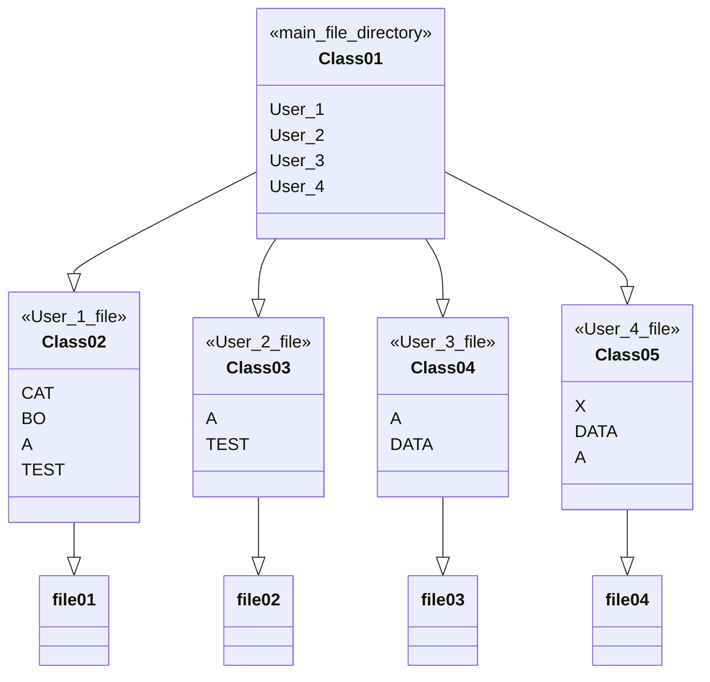
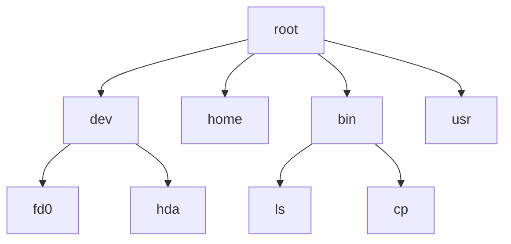
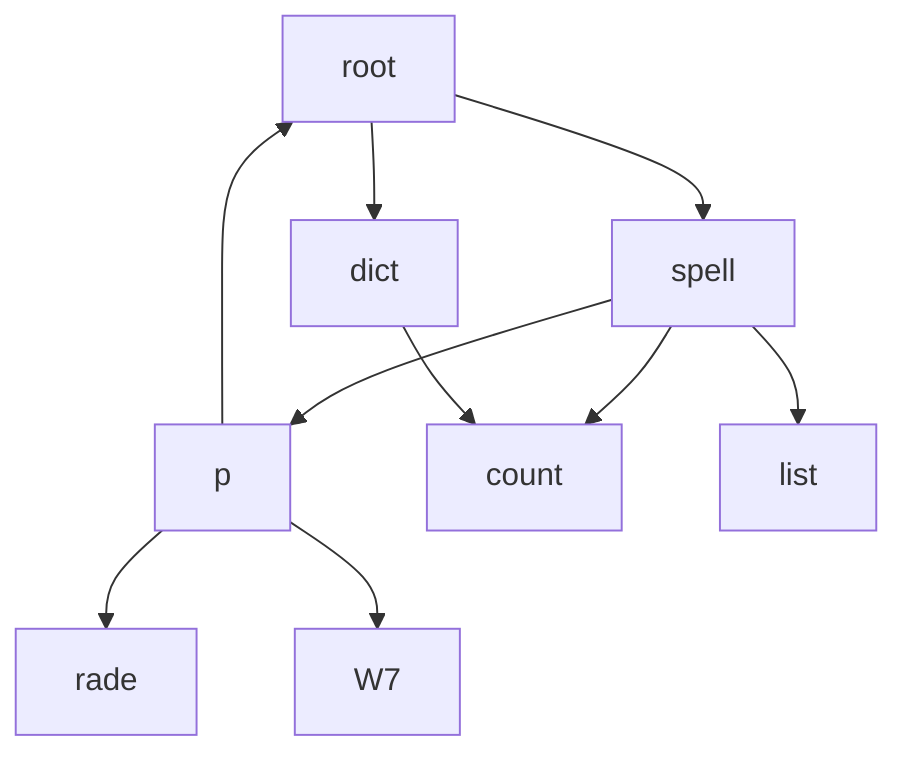
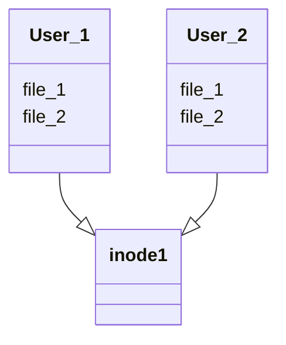

# 文件系统－目录
FCB的有序集合称为文件目录，一个FCB就是一个文件目录项。     
目录管理通过树形结构来解决和事先。    
## 目录结构
1. 单级目录结构  

| $FCB_{1}$ | $FCB_{2}$ | $FCB_{3}$ | $FCB_{4}$ | $FCB_{5}$ |  
|----|----|----|----|----|  
| 文件1 | 文件2|文件3|文件4|文件5|  

缺点：查找速度慢，文件不允许重名，不便于文件共享。  
2. 两级目录结构

主文件目录项记录用户名及对应用户文件目录所在的存储位置。用户文件目录项记录该用户文件的FCB信息。   
提高了检索的速度，解决了多用户之间的文件重名问题，文件系统可以在目录上实现访问控制，缺乏灵活性，不能对文件分类。   
3. 树形目录结构
明显提高对目录的检索速度和文件系统的性能。可以很方便的对文件分类，层次结构清晰，也能够有效的对文件进行管理和保护。不便于文件共享。   
由从根目录出发到所找文件通路上所以目录名与数据文件名用分隔符“/”链接拼接而成。   
**从根目录出发的路径称为绝对路径。**   
**当前的目录又称为工作目录**进程对各文件的访问都是相对于当前目录进行的。   

4. 无环图目录结构
在树形目录的基础上增加了一些指向同一节点的有向边，是整个目录成为一个有向无环图。   

对于共享文件，只存在一个真正的文件，任何改变都会为其他用户所见。    
## 文件共享
文件共享使多个用户共享同一个文件，系统中只需保留该文件的一个副本。    
1. 基于索引节点的共享方式（硬连接）
对于共享文件的用户组里，用户目录下的`xxx`共享文件，文件名对应这一个索引节点，在索引节点中包含文件名及其他文件属性信息。   

2. 利用符号链实现文件共享（软链接）
为使用户B能共享A的一个文件F，可以由系统创建一个LINK类型的新文件（只包含B的路径名），也取名为F，将该文件写入B的目录，以实现B的目录与文件F的链接。   
**只有文件主才拥有指向其索引节点的指针。**  
**其他用户只有该文件的文件名**    
> 利用符号链接实现网络文件共享时，只需提供该文件所在机器的网络地址及文件路径名。   
