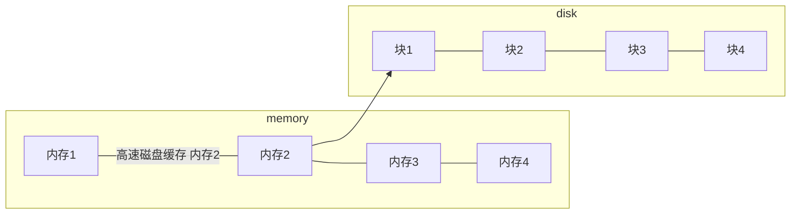
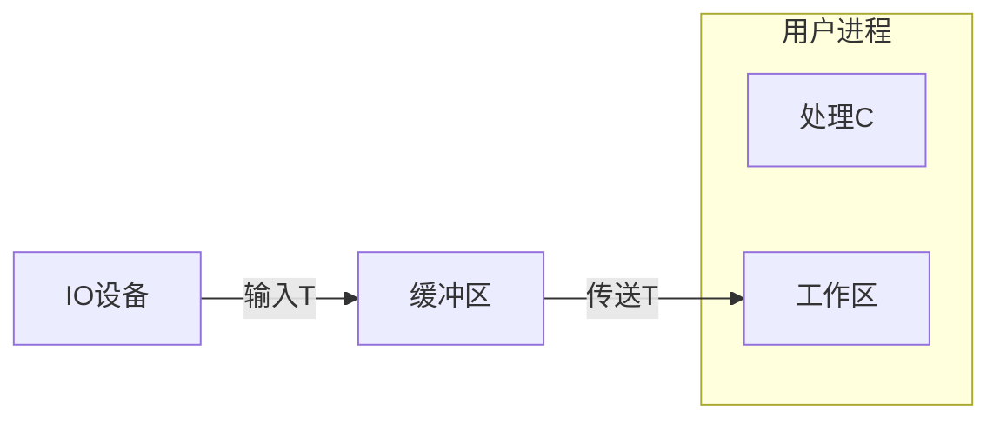
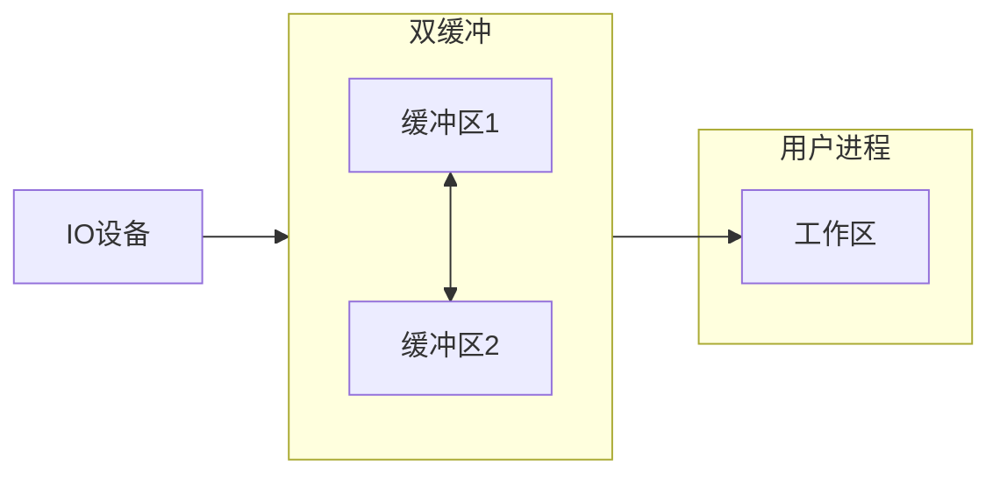
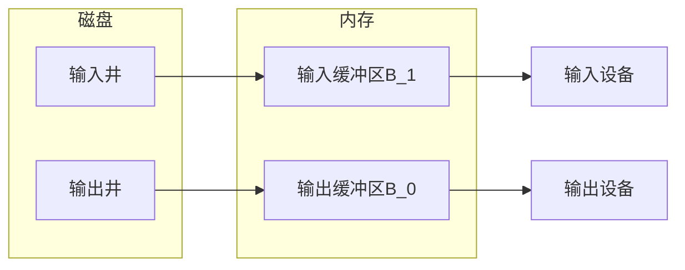

# 输入输出IO管理－设备独立性软件
## 高速缓存与缓冲区
1. 磁盘高速缓存  
**磁盘的高速缓存逻辑上属于磁盘，物理上则是驻留在内存的盘块。**

2. 缓冲区  
目的：
    1. 减少CPU与IO设备之间速度不匹配的矛盾
    2. 减少对CPU的中断频率，放宽对CPU中断响应时间的限制
    3. 解决基本数据单元大小（即数据粒度）不匹配的问题
    4. 提高CPU与IO设备之间的并行性
+ 单缓冲   
当设备与处理机交换数据时，先把数据写入缓冲区，然后需要数据的设备或处理机从缓冲区取走数据，在缓冲区写入或取出的过程，另一方需等待。  

单缓冲处理每块数据的用时为：   
$max(C,T)+M$
+ 双缓冲

双缓冲处理一块数据的用时为：  
$max(C+M,T)$
+ 循环缓冲  
包含多个大小相等的缓冲区，每个缓冲区里有一个链接指针指向下一个缓冲区，最后一个缓冲区指针指向第一个缓冲区指针，形成一个环形。  
+ 缓冲池
## 设备分配与回收
+ 设备分配的数据结构

|设备分配的数据结构|
|-----|
|设备控制表(DCT)|
|控制器控制表(COCT)|
|通道控制表（CHCT）|
|系统设备表(SDT)|

设备控制表  
|设备控制表|
|----|
|设备类型type|
|设备标识符: deviceid|
|设备状态：等待/不等待 忙/闲|
|指向控制表的指针|
|重复执行次数或时间|
|设备队列的队首指针|

COCT
|COCT|
|----|
|控制器标识符:controllerid|
|控制器状态:忙/闲|
|与控制器连接的通道表指针|
|控制器队列的队尾指针|

CHCT
|COCT|
|----|
|通道标识符:channelid|
|通道状态:忙/闲|
|与通道连接的控制器表首址|
|通道队列队尾指针|

SDT
|表目i|
|----|
|设备类|
|设备标识符|
|DCT|
|驱动程序入口|

**逻辑设备名到物理设备名的映射**   
为了实现设备独立性，在应用程序中使用逻辑设备名来请求某类设备，系统中设置一个逻辑设备表（LUT）。  
## SPOOLing 技术（假脱机技术）
为了缓和CPU的高速性与IO设备的低速性之间的矛盾。  
+ 输入井与输出井
在磁盘上开辟出的两个存储区域。  
输入井模拟脱机输入时的磁盘，用于收容IO设备输入的数据。    
输出井模拟脱机输出时的磁盘，用于收入用户程序的输出数据。   
+ 输入与输出缓冲区
在内存开辟的两个缓冲区。   
输入缓冲区用于暂存由输入设备送来的数据，以后在传送到输入井。    
输出缓冲区用于暂存从输入井送来的数据，以后在传送到输出井。   

