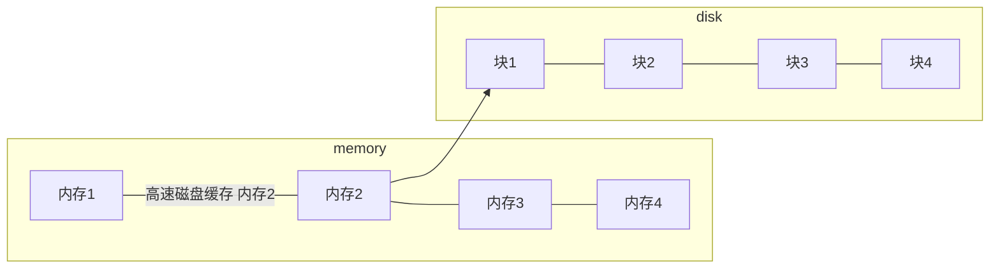
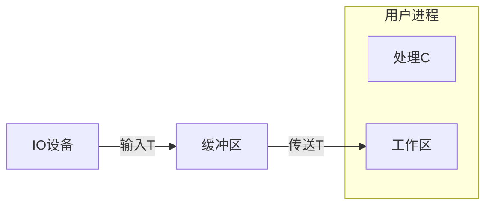
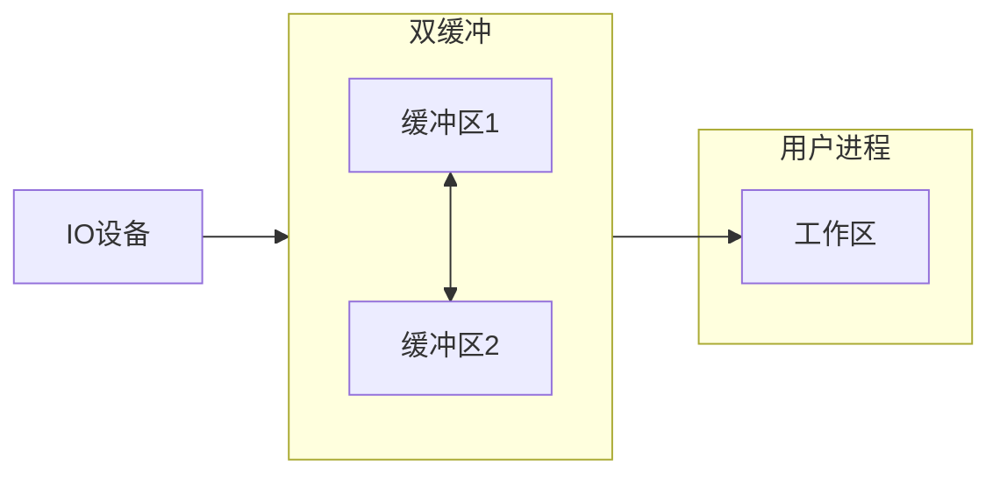

# 输入输出IO管理－设备独立性软件
## 高速缓存与缓冲区
1. 磁盘高速缓存  
**磁盘的高速缓存逻辑上属于磁盘，物理上则是驻留在内存的盘块。**

2. 缓冲区  
目的：
    1. 减少CPU与IO设备之间速度不匹配的矛盾
    2. 减少对CPU的中断频率，放宽对CPU中断响应时间的限制
    3. 解决基本数据单元大小（即数据粒度）不匹配的问题
    4. 提高CPU与IO设备之间的并行性
+ 单缓冲
当设备与处理机交换数据时，先把数据写入缓冲区，然后需要数据的设备或处理机从缓冲区取走数据，在缓冲区写入或取出的过程，另一方需等待。  

单缓冲处理每块数据的用时为：   
$max(C,T)+M$
+ 双缓冲

双缓冲处理一块数据的用时为：  
$max(C+M,T)$
+ 循环缓冲
