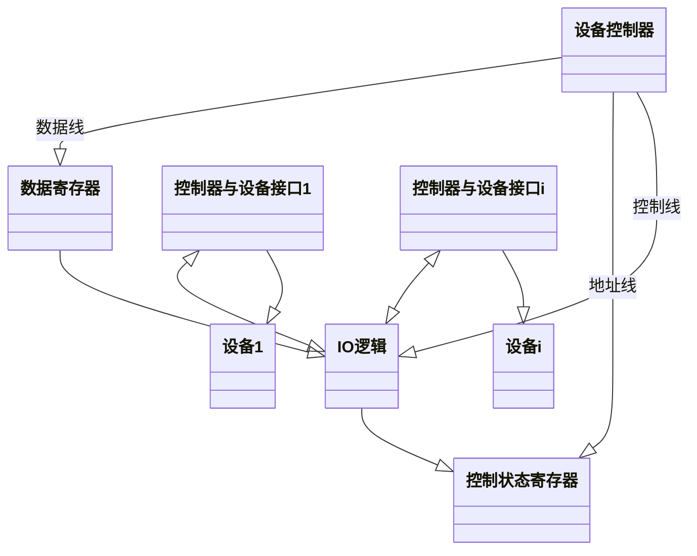
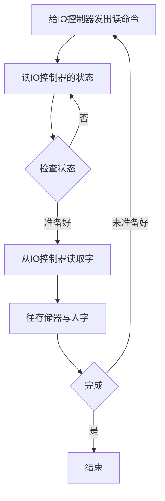
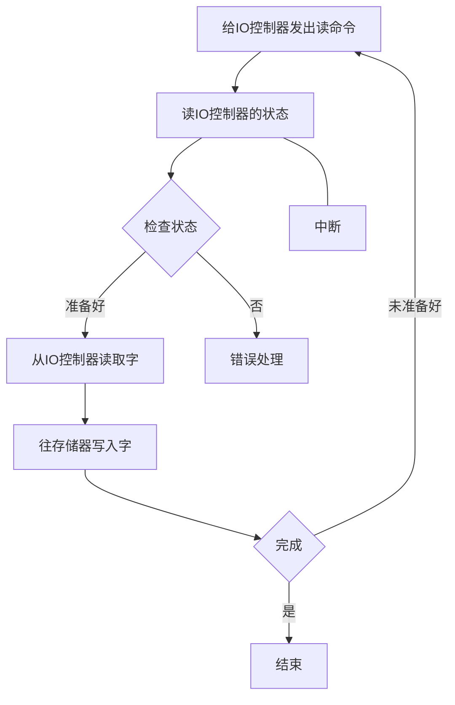
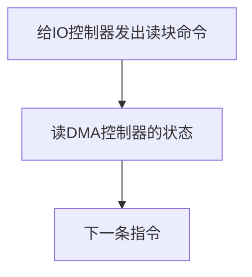

# 输入/输出（IO）管理—IO设备概述
## IO设备
**设备的分类：**
1. 块设备：*信息交换以数据块为单位。*
2. 字符设备：*信息交换以字符为单位。*
3. 低速设备
4. 中速设备
5. 高速设备

**I/O接口**

IO逻辑**实现对设备的控制。**它通过一组控制线与CPU交互，对从CPU收到的I/O命令进行译码。  
设备控制器的主要功能：
1. 接受和识别CPU发来的命令，如磁盘控制器能接受读，写，查找等命令。  
2. 数据交换，包括设备和控制器之间的数据传输，以及控制器和主存之间的数据数据传输。   
3. 标识和保护设备的状态，以工CPU处理   
4. 地址识别   
5. 数据缓冲   
6. 差错控制   

**IO端口是指设备控制器中可被CPU直接访问的控制器**    
1. 数据寄存器   
2. 状态控制器   
3. 控制寄存器   
通信的两种方法：   
1. 独立编址   
2. 统一编址   

## IO控制方式
1. 程序直接控制方式。   

缺点：只能串行工作，工作效率低。
2. 中断驱动方式    

允许IO设备主动打断CPU并请求服务，从而解放CPU，使其向IO控制器发送读命令后可以继续做其他的有用的工作。  
3. DMA方式   

特点：
1. 基本单位是数据块。  
2. 所传送的数据，是从设备直接送入内存，或者相反。  
3. 仅在传送一个或多个数据的开始和结束时，才需CPU干预，整块数据的传送是在DMA控制器的控制下完成的。  

4. *通道控制方式   
IO通道是指专门负责输入/输出的处理机。  
通道指令单类型单一，没有自己的内存，通道所执行的通道程序是放在主机的内存中的，也就是说通道与CPU共享内存。   
## IO软件层次结构
| IO软件的层次结构 |
| ---- |
| 用户层的IO软件 |
| 设备独立性软件 |
| 设备驱动程序 |
| 中断处理程序 |
| 硬件 |

1. 用户层IO软件：实现与用户交互的接口，用户可以直接在用户层提供的，与IO操作有关的库函数，对设备进行操作。   
2. 设备独立性软件: 用于实现用户程序与设备驱动器的统一接口，设备命令，设备的保护及设备的分配与释放等，同时为设备管理和数据传送提供必要的存储空间。   
设备独立性也称设备无关性，使得应用程序独立于具体使用的物理设备。  
1. 设备驱动程序: 与硬件直接相关，负责具体实现系统对设备发出的操作命令，驱动IO设备工作的驱动程序。**每类设备配置一个设备驱动程序**  
2. 中断处理程序

## 应用程序IO接口
1. 字符设备接口
传输率较低，不可寻址，并且在输入/输出时通常采用中断驱动方式。例如：键盘，打印机  
2. 块设备接口
块设备是指数据的存取和传输是以数据块为单位的设备，例如：磁盘。磁盘设备常采用DMA的方式。    
3. 网络设备接口
许多操作系统提供的网络IO接口为网络套接字接口。
4. 阻塞/非阻塞IO
