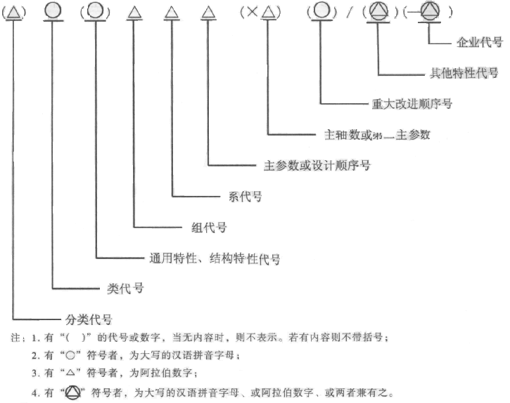
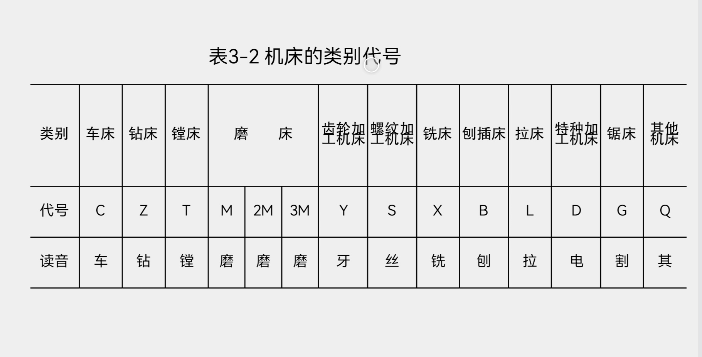
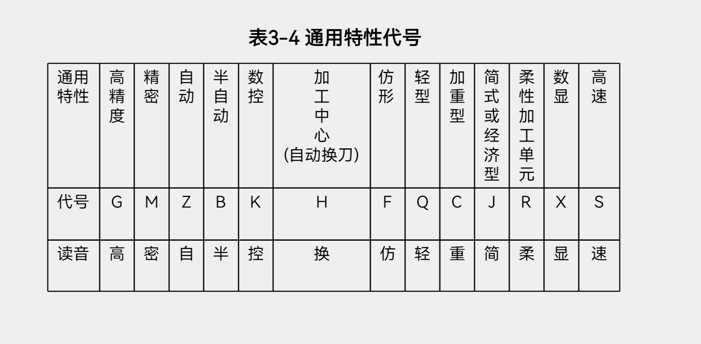
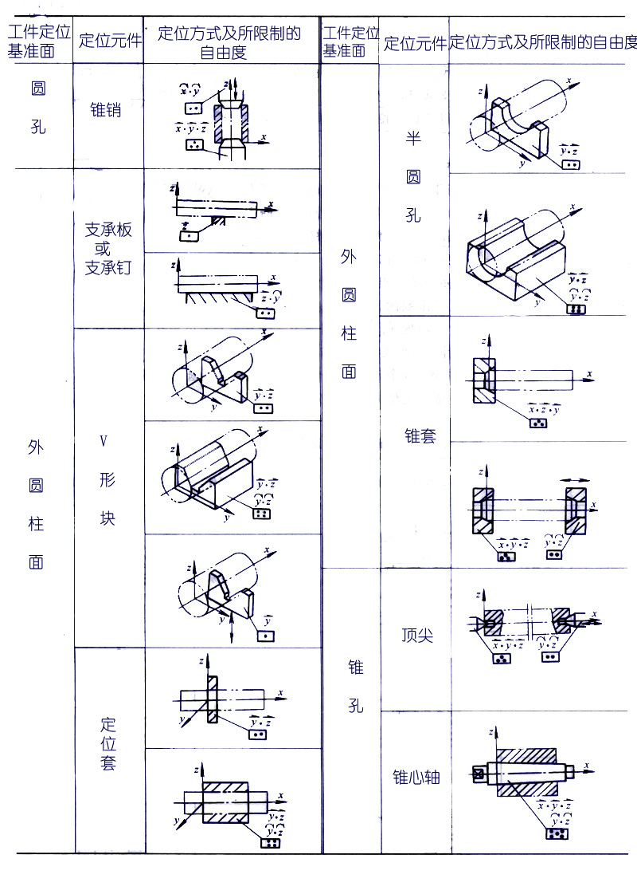
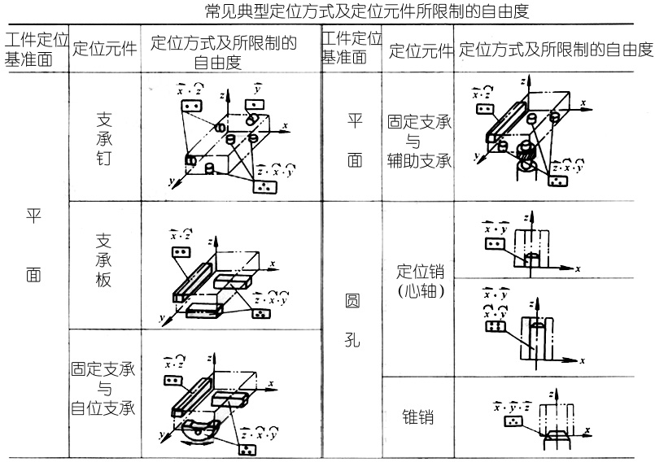
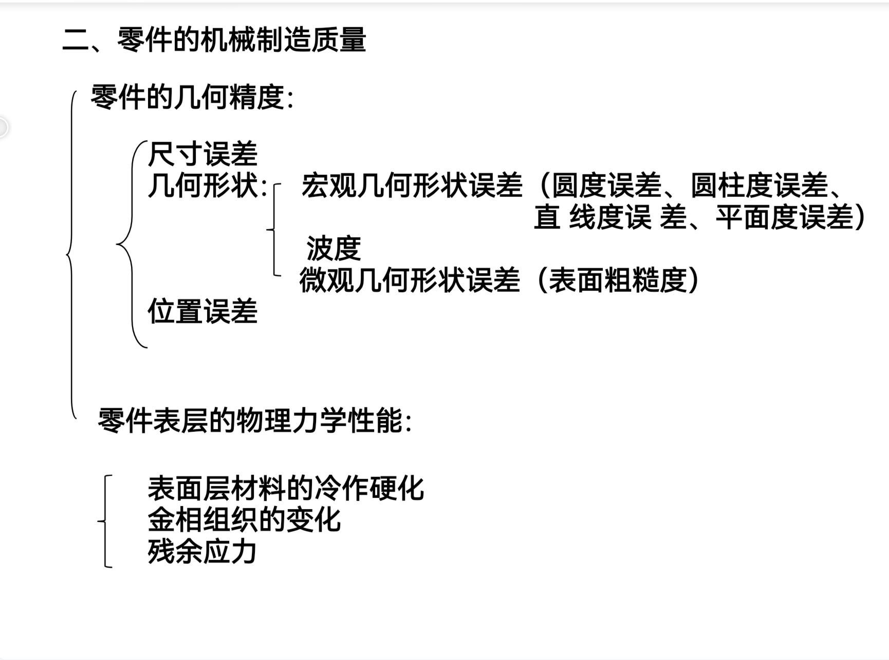
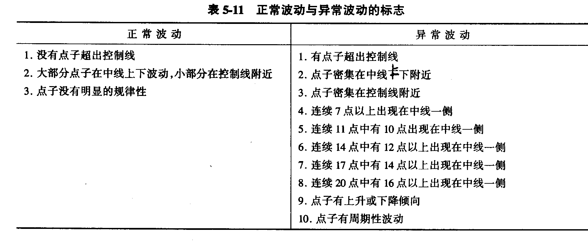

# 机械制造基础

- [机械制造基础](#机械制造基础)
  - [机械加工方法](#机械加工方法)
    - [零件的成型原理](#零件的成型原理)
  - [金属切削原理与刀具](#金属切削原理与刀具)
    - [“三面两刃一尖”](#三面两刃一尖)
    - [刀具角度的参考平面](#刀具角度的参考平面)
    - [刀具的标注角度](#刀具的标注角度)
    - [减少积屑瘤的措施](#减少积屑瘤的措施)
    - [磨削加工的实质](#磨削加工的实质)
    - [切屑的类型](#切屑的类型)
    - [刀具磨损与刀具寿命](#刀具磨损与刀具寿命)
    - [刀具磨损过程及磨钝标准](#刀具磨损过程及磨钝标准)
    - [切削三要素与四个结论](#切削三要素与四个结论)
  - [金属切削机床](#金属切削机床)
    - [机床的工艺范围](#机床的工艺范围)
    - [机床型号的编制](#机床型号的编制)
  - [机床夹具的原理与设计](#机床夹具的原理与设计)
    - [夹具的基本组成](#夹具的基本组成)
    - [夹具工作原理](#夹具工作原理)
    - [六点定位原理](#六点定位原理)
    - [定位基准面与定位元件](#定位基准面与定位元件)
  - [机械制造质量分析与控制](#机械制造质量分析与控制)
    - [包括什么：](#包括什么)
    - [加工原理误差与调整误差](#加工原理误差与调整误差)
    - [工艺能力系数](#工艺能力系数)
    - [正常波动与异常波动的标志](#正常波动与异常波动的标志)
    - [系统误差](#系统误差)
  - [工艺规程设计](#工艺规程设计)
    - [工艺规程，工序，工步，工作行程](#工艺规程工序工步工作行程)
    - [生产类型](#生产类型)
    - [加工阶段的划分](#加工阶段的划分)
    - [粗精基准的选用原则](#粗精基准的选用原则)
    - [机器装配的方法](#机器装配的方法)
    - [互换法的实质](#互换法的实质)
    - [工艺尺寸链计算](#工艺尺寸链计算)

## 机械加工方法

### 零件的成型原理

材料去除原理：     
$$\bigtriangleup m < 0$$    
材料基本不变原理：   
$$\bigtriangleup m = 0$$   
材料累加成形原理：    
$$\bigtriangleup m > 0$$     

## 金属切削原理与刀具

### “三面两刃一尖”

**前面：（前刀面）：** 刀具上与切屑接触并相互作用的表面。   
**主后面（主后刀面）：** 刀具上与工件过渡表面接触并相互作用的表面。   
**副后面（副后刀面）：** 刀具上与工件已加工表面接触并相互作用的表面。   
**主切削刃：** 前刀面与主后刀面的交线，它完成主要的切削工作。   
**副切削刃：** 前刀面与副后刀面的交线，它配合主切削刃完成切削工作，并最终形成已加工表面。   
**刀尖：** 连接主切削刃与副后刀面的交线，它配合主切削刃完成切削工作，并最终形成已加工表面。   

### 刀具角度的参考平面

1. 切削平面  
通过主切削刃上某一点并与工件加工表面相切的平面。  
2. 基面   
通过主切削刃上某一点并与该点切削速度方向相垂直的平面。   
3. 正交平面   
通过主切削刃上某一点并与主切削刃在基面上的投影相垂直的平面。   

### 刀具的标注角度

- 前角   
$$\gamma_{o}$$  
在正交平面内测量的前面与基面之间的夹角，前角表示前面的倾斜程度。有正负值和零值之分。    
- 后角   
$$\alpha_{o}$$  
在正交平面内测量的主后面与切削平面之间的夹角。表示主后面的倾斜程度。      
- 主偏角  
$$\kappa_{r}$$  
在基面内测量的主切削刃在基面上的投影与进给运动方向夹角，主偏角一般为正值。   
- 副偏角  
$$\kappa^{`}_{r}$$
在基面内测量的副切削刃在基面上的投影与进给运动反方向的夹角，副偏角一般为正值。   
- 刃倾角   
$$\lambda_{s}$$  
在切削平面内测量的主切削刃与基面之间的夹角。  

当车刀刀尖装得高于工件中心线时，就会使车刀的工作前角增大，实际工作后角减小，增加车刀后面与工件表面的摩擦；  
当车刀刀尖装得低于工件中心线时，就会使车刀的工作前角减小，实际工作后角增大，切削阻力增大使切削不顺。   

### 减少积屑瘤的措施   

  

### 磨削加工的实质  

砂轮的磨削过程实际上就是磨粒对工件表面的切削、刻划和滑擦三种作用的综合，磨削过程中，磨粒本身也由尖锐逐渐变钝，使切削作用变差，切削力变大。由于各磨粒的工作情况不同，所以磨削时除了产生正常切屑外，还有金属微尘等。 

### 切屑的类型

1. 带状切屑。  
2. 挤裂切屑。  
3. 单元切屑。  
4. 崩碎切屑。 脆性材料。   

### 刀具磨损与刀具寿命   

1. 刀具前面磨损。  
2. 刀具后面磨损。  
3. 边界磨损。   
有C区，B区，N 区  
B区最大值为理论磨损极限。   

### 刀具磨损过程及磨钝标准   
1. 初期磨损阶段。   

2. 正常磨损阶段。  
3. 急剧磨损阶段。  

### 切削三要素与四个结论

**切削三要素**   
1. 进给量
$$f$$
2. 切削速度
$$v$$
1. 背吃刀量
$$a_{p}$$

**四个结论**   
1. 切削用量三要素对切削力的影响由大到小的顺序为
$$ap－f－v$$
2. 切削用量三要素对切削热的影响顺序为
$$ap-v-f$$
3. 切削用量三要素对切削温度的影响由大到小的顺序为
$$v-f-ap$$
4. 切削用量三要素对刀具寿命影响的大小按顺序为  
$$v—f—ap$$

## 金属切削机床

### 机床的工艺范围

机床的工艺范围是指在机床上加工的工件类型和尺寸，能够加工完成何种工序，使用什么刀具等。   
通用机床具有较宽的工艺范围，在同一台机床上可以满足较多的加工需要，适用于单间小批生产。   
专用机床是为了特定零件的特定工序而设计的，自动化程度和生产率较高，但它的加工范围很窄。   
数控机床这既有较宽的工艺范围，又能满足零件较高精度的要求，并可实现自动化加工。   

### 机床型号的编制  

    

   

   

## 机床夹具的原理与设计   

### 夹具的基本组成   
1. 定位元件
2. 夹紧装置
3. 对刀元件
4. 导引元件
5. 其他装置
6. 连接元件与连接表面
7. 夹具体

### 夹具工作原理

1. 使工件在夹具中占有正确的加工位置。这是通过工件各定位面与夹具的相应定位元件的定位工作面接触、配合和对准来实现的。   
2. 夹具对机床应先保证有准确的相对位置，而夹具结构又保证定位元件的定位工作面对夹具与机床相连接的表面之间的相对准确位置，这就保证了夹具定位工作面相对机床切削运动形成表面的准确几何位置，也就达到了工件加工面对定位基准的相互位置精度。    
3. 使刀具相对有关的定位元件的定位工作面调整到准确位置，这就保证了刀具在工件上加工出的表面对定位基准的位置尺寸   

### 六点定位原理   

1. 这样分布的六个定位支撑点，限制了工件全部六个自由度，称为工件的“完全定位”。   
2. 这种允许少于六点的定位称为“不完全定位”或“部分定位”。   
3. 如果工件的定位支撑点数小于应限制的自由度数，必然出现达不到所要求的加工精度，这种工件定位点不足的情况，称为“欠定位”。   

**不完全定位与完全定位是允许的，欠定位是不允许的。**

### 定位基准面与定位元件

   
   

## 机械制造质量分析与控制

### 包括什么：   

   

### 加工原理误差与调整误差  

**原理误差**    
是由于采用了近似的加工运动或者近似的刀具轮廓和近似的加工方法而产生的原始误差。    
例如：   
1. 用尖车刀车外圆，成形运动不是光滑的圆柱面，而是一个螺旋面  
2. 用齿轮铣刀铣齿时刀号的确定   
3. 用齿轮滚刀加工齿轮时，滚刀是采用阿基米德基本蜗杆或法向直廓蜗杆代替渐开线蜗杆   

**调整误差**   
在机械加工的每一个工序中，总是要对工艺系统进行这样或那样的调整工作，由于调整不可能绝对的准确，因而产生调整误差。不同的调整方式，有不同的误差来源。    

试切法   
在精加工场合下，试切的最后一刀，总是很薄的。这时如果认为试切尺寸已经合格，就合上纵走刀机构切削下去，这新切到部分的切深比已试切的部分大，切削刃不打滑，就要多切下一点，因此最后所得的工件尺寸要比试切部分的尺寸小些（镗孔则相反）。    
粗加工试切时情况刚好相反，由于粗加工的余量比试切层大很多，受力变形也大很多，因此粗加工所得的尺寸要比试切部分的尺寸大些。   

### 工艺能力系数

$$
C_{p} = T / 6\sigma	
$$

### 正常波动与异常波动的标志  

### 系统误差

常值系统性误差—在顺序加工一批工件中，其大小和方向皆不变的误差，称为常值系统性误差，如铰刀直径大小的误差、测量仪器的一次对零误差  
变值系统性误差—在顺序加工一批工件中，其大小和方向循某一规律变化的误差，称为变值系统性误差。如：由于刀具磨损引起的加工误差，机床或刀具或工件的受热变形引起的加工误差等。显然，常值系统性误差与加工顺序无关，而变值系统性误差与加工顺序有关   

## 工艺规程设计

### 工艺规程，工序，工步，工作行程   

人们把合理工艺过程有关内容写成工艺文件的形式，用以指导生产，这些工艺文件即称为工艺规程。    
工序是组成机械加工过程的基本单元，一个工序是指一个（或一组）工人，在一台机床（或一个工作地点），对同一工件（或同时对几个工件）所连续完成的那一部分工艺过程。   
制订机械加工工艺过程，必须确定该工件要经过几道工序以及工序进行的先后顺序。进列出主要工序名称以及加工顺序的简略工艺过程，为工艺路线。   
工步是在加工表面不变，加工工具不变，切削用量不变的条件下所连续完成的那部分工序。   
工作行程也称走刀，是加工工具在加工表面上加工一次所完成的工步。   

### 生产类型

生产类型的划分依据是产品或零件的年生产纲领。    
1. 单件生产
2. 批量生产
3. 大批量生产

### 加工阶段的划分
1. 粗加工阶段
2. 半精加工阶段
3. 精加工阶段
4. 光整加工阶段

有时，由于毛坯中余量特别大，表面特别粗糙，在粗加工前还要有去皮加工阶段，为了及时发现毛坯废品以及减少运输工作量，常把去皮加工放在毛坯准备车间进行。   

### 粗精基准的选用原则   

> 要解决的首要问题是合理选择定位基准。   

**精基准的选择原则**   
1. 基准重合原则——应尽可能选择被加工表面的设计基准为精基准，这样可以避免由于基准不重合引起的定位误差。  
2. 统一基准原则——应尽可能选择用同一组精基准加工工件上尽可能多的加工表面，以保证各加工表面之间的相对位置关系，采用统一基准加工工件还可减少夹具种类，降低夹具的设计制造费用。
3. 互为基准原则——当工件上两个加工表面之间的位置精度要求比较高时，可以采用两个加工表面互为基准反复加工的方法。  
4. 自为基准原则——某些表面的精加工工序，要求加工余量小而均匀，常以加工表面自身为精基准。   

**粗基准的选择原则**
1. 保证零件加工表面相对于不加工表面具有一定位置精度的原则。
   1. 被加工零件上如有不加工表面应选不加工表面做粗基准。这样可以保证不加工表面相对于加工表面具有较为精确的相对位置关系。
   2. 当零件上有几个不加工表面时，应选择与加工面相对位置精度要求较高的不加工表面作粗基准。
2. 合理分配加工余量的原则——从保证重要表面加工余量均匀考虑，应选择重要表面作粗基准，床身加工就是一个很好的实例。    
3. 便于装夹的原则——为使工件定位稳定，夹紧可靠，要求所选用的粗基准尽可能平整、光洁、不允许有锻造飞边，铸造浇铸口切痕或其它缺陷，并有足够的支承面积    
4. 粗基准一般不准重复使用的原则——在同一尺寸方向上粗基准通常只允许使用一次，这是因为粗基准一般都很粗糙，重复使用同一粗基准所加工的两组表面之间的位置误差会相当大，因此，粗基准一般不得重复使用   

### 机器装配的方法  

1. 互换法
   1. 完全互换法
   2. 统计互换法
2. 分组装配法
3. 修配装配法
4. 调整装配法
   1. 可动调整法
   2. 固定调整法
   3. 误差抵消调整法

### 互换法的实质
用控制零件加工误差来保证装配精度的一种方法。   
完全互换法的优点：    
1. 装配质量稳定可靠，装配过程简单,装配效率高，易于实现自动装配，产品维修方便。  
2. 对于工人技术水平要求不高，易于扩大生产。  
3. 便于组织流水作业及自动化装配。  
4. 易于实现零，部件的专业协作，降低成本。  
5. 备件供应方便。   

### 工艺尺寸链计算

