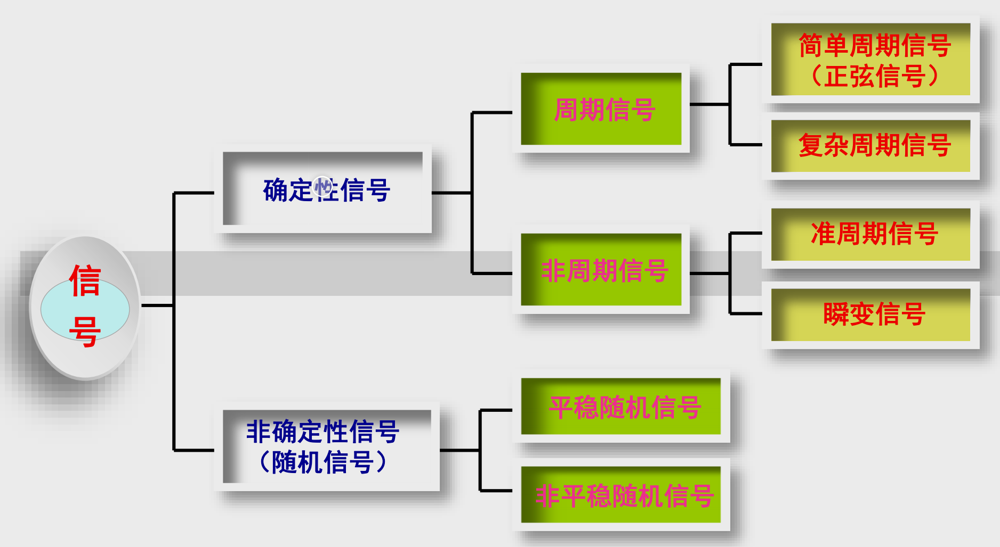

# 机械工程测试技术

- [机械工程测试技术](#机械工程测试技术)
  - [绪论](#绪论)
    - [传感器](#传感器)
    - [信号调理装置](#信号调理装置)
    - [显示记录装置](#显示记录装置)
    - [小结](#小结)
  - [信号及其描述](#信号及其描述)
    - [测试工作的实质（目的，任务）](#测试工作的实质目的任务)
    - [按信号随时间的变化规律分类](#按信号随时间的变化规律分类)
    - [各类信号特征](#各类信号特征)
    - [信号的描述与分析方法](#信号的描述与分析方法)
      - [狄氏条件](#狄氏条件)
    - [周期信号的频谱](#周期信号的频谱)
      - [周期信号的频谱的特点](#周期信号的频谱的特点)
    - [非周期信号的频谱](#非周期信号的频谱)
      - [非周期信号频谱的特点](#非周期信号频谱的特点)
    - [自相关函数](#自相关函数)
    - [互相关函数](#互相关函数)
    - [小结](#小结-1)
  - [测试装置的基本特性](#测试装置的基本特性)

## 绪论

基本的测试系统由**传感器**，**信号调理装置**，**显示记录装置**三部分组成。   
### 传感器    
感受被测量的变化并将其转换成为某种易于处理的
形式，通常为电量（电压、电流、电荷）或电参数
（电阻、电感、电容）。

### 信号调理装置   
对传感器的输出做进一步处理（转换、放大、调制
与解调、滤波、非线性校正等），以便于显示、记
录、分析与处理等。   

### 显示记录装置    
对传感器获取并经过各种调理后的测试信号进行显
示、记录、存储，某些显示记录装置还可对信号进
行分析、处理、数据通讯等    

### 小结
- 测试是测量与试验的概括，测试工作的目的是为了最大限度地
不失真获取关于被测对象的有用信息。   
- 测试是测量与试验的概括，测试工作的目的是为了最大限度地
不失真获取关于被测对象的有用信息。   
- 测试是测量与试验的概括，测试工作的目的是为了最大限度地
不失真获取关于被测对象的有用信息。   

## 信号及其描述

信息： 事物运动状态和运动方式的反映。    
**信息既不是物质也不具有能量，存在于某种形式的载体上。**   
信号: 信息的载体。   
**信号通常是物理、可测的（如电信号、
光信号等），通过对信号进行测试、
分析，可从信号中提取出有用的信息。**     
干扰：信号中除有用信息之外的部分。    
**由测试装置本身内部产生的无用部分称为噪声（noise）。**    

### 测试工作的实质（目的，任务）  

通过传感器获取与被测参量相对应的测试信号，利
用信号调理装置以及计算机分析处理技术，最大限
度地排除信号中的各种干扰、噪声，最终不失真地
获得关于被测对象的有关信息。    

### 按信号随时间的变化规律分类

### 各类信号特征

- **确定性信号**    

可以用确定的数学函数表示其随时间
变化规律的信号，包括周期信号和非
周期信号两类。    

- **周期信号**    

每隔一定的时间间隔精确重复其波形、
无始无终的信号。    
**正弦信号是构成其他信号的基本成分！**     

- **非周期信号**    

除周期信号以外的确定性信号称为
非周期信号 ，它又分为准周期信号
和瞬变信号两类。     

- **非确定性信号**    

不能用确定的数学函数表示其随时间变化规律的信号，也称为随机信
号或随机过程。随机信号一般用统计参数（数学期望、方差等）表示
其特征，包括平稳随机信号（过程）和非平稳随机信号（过程）两类。     

### 信号的描述与分析方法

均值反映了信号变化的中心趋势，也称为信号的直流分量。    
绝对均值相当于对信号进行全波整流后再滤波（平均）。    
信号的均值、绝对均值、均方值和均方根值都可作为信号强
度的量度。      
方差反映了信号偏离均值的程度，即信号中交流（谐波）成
分的大小。    

频域描述的目的是要得到信号的**频谱**，即信号的**频率构成**。   
了解信号的频谱，对设计动态测试方法、测试装置
有着重要的意义，是实现不失真测试的技术保障。    
要了解信号的频谱，通常是要根据信号的类别，借助
于不同的数学工具来实现。其中最基本的数学工具是
傅立叶级数（FS）和傅立叶变换（FT）。     
通过对周期信号的时域表达式进行**傅立叶级数**展开，可得
到周期信号的频谱（频率构成）。   

#### 狄氏条件    
⑴ 在任意有限区间内连续，或只有有限个第一类间断点
（左、右极限均存在）；    
⑵ 在一个周期内，只有有限个极值点。   

### 周期信号的频谱
任何周期信号都是由无穷多个频率、幅值、初相位互不相同
的正弦谐波信号叠加而成的！    

#### 周期信号的频谱的特点  

- 谐波性   
周期信号的频谱是离散的，由一系列离散的谱线组成。
- 离散性   
每条谱线对应于一个谐波分量，只出现在基频的整数倍
上。
- 收敛性   
工程中常见的周期信号，其谐波幅值总的趋势是随谐波
次数的增加而减小。通常可忽略较高次谐波的影响。  

复指数$e^{j\theta}$表示单位正弦向量！   
复指数$e^{jn\omega_{0}t}$表示幅值为1、随时间 t 以频率 变化的单
位正弦（谐波）信号！

### 非周期信号的频谱
通过对非周期信号（瞬变信号）的时域表达式进行傅立叶
变换，可得到非周期信号的频谱（频率构成）。    

#### 非周期信号频谱的特点 

- 非周期信号的频谱是连续的，其频谱中包含所有频率的谐波成分。

- $X(f)$具有“单位频率宽度上的幅值、相位”的含义，故非周期信
号的频谱严格上应称为频谱密度函数（简称频谱）。

- 非周期信号的幅值谱密度$|X(f)|$为有限值，但各次谐波分量的幅值$|X(f)|$为无穷小——能量有限。   

矩形窗函数的频谱是连续的，频谱范围无限宽广。信
号的截断相当于信号与窗函数相乘，截断后的信号的
频谱等于二者的卷积分，因此也具有连续、无限宽广
的频谱。

$\delta$函数可以把信号$x(t)$在脉冲发生时刻$t_{0}$时的
函数值$x(t_{0})$抽取出来。    

任一信号$x(t)$与单位脉冲函数$\delta(t-t_{0})$卷积分的结果，相当于把信号$x(t)$搬移到脉冲发生处（将
信号延时了$t_{0}$）。

⑴ 单位脉冲函数$\delta(t)$的频谱密度恒等于1。   
⑵ $\delta$函数具有无限宽广的频谱，且在任何频率上的谱
密度都是相等的。这种信号称为理想的白噪声。    

⑴ 周期单位脉冲序列的频谱也是一个周期脉冲序列。
⑵ 周期单位脉冲序列的典型应用是等时间间隔采样控
制。采样间隔（周期）$T_{s}$越小，其频谱谱线间隔$\frac{1}{T_{s}}$越大，越有利于减小采样所造成的失真。

### 自相关函数   

自相关函数用来描述信号在某一时刻的瞬时值与该信号延
时时间τ以后的瞬时值之间的相似程度，是关于延时时间τ
的函数。

⑴ 周期信号的自相关函数中保留了原周期信号幅值和频
率信息，但丢失了相位信息。    
⑵ 周期信号的自相关函数当$t -> \infin$时并不收敛。   

利用信号的自相关函数可以非常有效地区别信号的类型。
只要信号中含有周期成分，其自相关函数当$τ -> \infin$时也
不衰减，并具有明显的周期性。     

### 互相关函数
互相关函数用来描述一个信号在某一时刻的瞬时值与另一
个信号延时时间τ以后的瞬时值之间的相似程度，是关于
延时时间τ的函数。    
   
⑴ 同频周期信号的互相关函数中不仅保留了原周期信号的
幅值和频率信息，也保留了相位（差）信息。   
⑵ 同频周期信号的互相关函数当$τ -> \infin$时并不收敛。   

###  小结

- 信息是事物运动状态和运动方式的反映。信号是信息的载体，
其中包含着关于被测对象的有用信息。

- 信号分为确定性信号和非确定性信号（随机信号）两大类，其
中确定性信号又分为周期信号和非周期信号两类。正弦（谐波）
信号是构成各类信号的基本成分。

- 信号的频谱指的是信号的频率构成（信号中包括着哪些正弦谐
波成分？它们的频率、幅值、初相位如何？）。了解信号的频
谱是实现不失真测试的重要技术保证。

- 进行周期信号频谱分析的数学工具是傅立叶级数。周期信号的
频谱具有离散性、谐波性、收敛性三个特点。

- 进行非周期信号频谱分析的数学工具是傅立叶变换。非周期信
号的频谱为频谱密度，主要特点是频谱的连续性，即频谱中包
含着任何频率的谐波成分。

- 本章中所介绍的几种典型信号（矩形窗函数、单位脉冲函数、
正余弦函数、周期单位脉冲序列）在测试工作中有着重要的作
用，要熟记它们的特点特别是频谱的特点。

- 除频域描述外，信号的时域描述、幅值域描述以及时延域描述
等均可从不同角度揭示出关于被测对象的有用信息。特别是时
延域相关分析，在不同领域有着非常广泛的应用。

## 测试装置的基本特性

