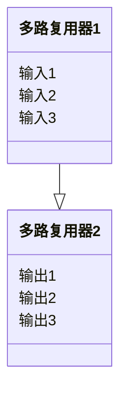

# 数据链路层－介质访问控制

- [数据链路层－介质访问控制](#数据链路层介质访问控制)
  - [信道划分介质访问控制](#信道划分介质访问控制)
  - [随机访问介质的访问控制](#随机访问介质的访问控制)
    - [ALOHA 协议](#aloha-协议)
    - [CSMA 协议](#csma-协议)
    - [CSMA／CD 协议](#csmacd-协议)
    - [CSMA/CD 协议](#csmacd-协议-1)
    - [轮询访问：令牌传递协议](#轮询访问令牌传递协议)

> 介质访问控所要完成的主要任务是，为使用介质的每个节点隔离来自同一信道上的其他节点所传送的信号，以协调活动节点的传输。  

## 信道划分介质访问控制
信道划分介质访问控制将使用介质的每个设备与来自同一通信信道上的其他设备的通信隔离开来，把时域和频域资源合理分配给网络上的设备。    

实质是通过分时，分频，分码等方法把原来一条广播信道，逻辑上分为几条用于两个节点之间通信互不干扰的子信道。   
+ 频分多路复用  
将多路基带信号调制到不同的频率载波上   
+ 时分多路复用   
将一条物理信道按时间分为若干个时间片，轮流地分配给多个信号使用。   
+ 波分多路复用
它在一根光纤中传输多种不同波长频率的光信号，由于波长频率不同，各路光信号互不干扰，最后再用波长分解器复用器将各路波长分解出来。   
+ 码分多路复用   
采用不同的编码来区分各路原始信号的一种复用方式。   
码分多址 CDMA      
每个比特时间在划分成m时间槽，称为码片（Chip）     
## 随机访问介质的访问控制
常用有ALOHO,CSMA,CSMA/CD,CSMA/CA   
胜利者通过争用获得信道，从而获得信息的发送权。    
### ALOHA 协议
+ 纯 ALOHA 协议
当网络中的任何一个站点需要发送数据时，可以不进行任何检测就发送数据。   
如果在一端时间内没有收到确认，就是发送了冲突，在一定时间后重发。   
+ 时隙 ALOHA 协议
把个站点的时间同步起来，将时间划分为一段段等长的时隙，规定只能在每个时隙开始时才能发送一个帧。  
### CSMA 协议   
在发送前先监听一下公共信道。   
+ 1－坚持CSMA协议  
一个节点要发送数据时，首先监听信道，空闲就发，否则等待，如果发送冲突，就随机等待一段时间。  
+ 非坚持CSMA协议  
一个节点要发送数据时，首先监听信道，空闲就发，否则就放弃随机等待一定时间。
+ p－坚持CSMA协议  
首先监听信道：如果信道忙，就持续监听，直至信道空闲；如果信道空闲，那么以概率p发送数据，以概率1-p推迟到下一个时隙；如果在下一个时隙信道仍然空闲，那么仍以概率p发送数据，以概率1-p推迟到下一个时隙；这个过程一直持续到数据发送成功或因其他结点发送数据而检测到信道忙为止，若是后者，则等待下一个时隙再重新开始监听
### CSMA／CD 协议
碰撞检测，边发送边监听，如果监听到了碰撞，便立即停止发送，等待随机一段时间后，重新开始尝试发送数据。   
$$
最短帧长 ＝ 总线传播时延 \times 数据传播速率 \times 2
$$   
### CSMA/CD 协议
无线网不能直接使用`CSMA／CD`协议因为   
1. 在无线通信中，并非所以站点都能听到对方，存在“隐蔽站”的问题。   
2. 接受信号远小于发送信号的强度，且在无线介质上的信号强度变化的动态变化范围大，实现碰撞检测的花费会很大。     
    1. 若站点最初有数据要发送（而不是发送不成功再进行重传），且检测到信道空闲，在等待若发送站在规定时间（由重传计时器控制）内没有收到确认帧 ACK，就必须重传该帧
    2. 否则，站点执行CSMA/CA退避算法，选取一个随机回退值。一旦检测到信道忙，退避计时器就保持不变。只要信道空闲，退避计时器就进行倒计时。   
    3. 当退避计时器减到0时（这时信道只可能是空闲的），站点就发送整个帧并等待确认
    4. 送站若收到确认，就知道已发送的帧被且的站正确接收。这时如果要发送第二帧，要从步骤2）开始，执行CSMA/CA退避算法，随机选定一段退避时间。  

### 轮询访问：令牌传递协议   
在令牌传递协议中，一个令牌（Token）沿着环形总线在各结点计算机间依次传递。  
令牌是一个特殊的MAC控制帧，它本身并不包含信息，仅控制信道的使用，确保同一时刻只有一个站时间内不要发送数据，以免出现碰撞。   
当环上的一个站点希望传送帧时，必须等待令牌。一旦收到令牌，站点便可启动发送帧。    
传输介质的物理拓扑不必是一个环，当属设备间传递通路逻辑上必须是一个环。    