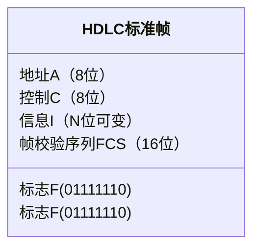

# 数据链路层－数据链路层的功能
> 数据链路层在物理层提供服务的基础上向网络层提供服务，其主要作用是加强物理层传输原始始比特流的功能，将物理层提供的可能出错的物理连接改造为逻辑上无差错的数据链路，使之对网络层表现为一条无差错的链路。   
## 为网络层提供服务
+ 无确认的无连接服务    
源机器发送数据帧时不需先建立链路连接，目的机器收到数据帧时不需发回确认。     
+ 有确认的无连接服务  
源机器发送数据帧时不需先建立链路连接，但目的机器收到数据帧时必须发回确认。     
+ 有确认的面向连接服务  
帧传输过程分为三个阶段：建立数据链路、传输帧、释放数据链路。目的机器对收到的每一帧都要给出确认，源机器收到确认后才能发送下一帧，因而该服务的可靠性最高。     
## 链路管理
## 帧定界，帧同步与透明传输
*两台主机之间传输信息时，必须将网络层的分组封装成帧，以帧的格式进行传送。将一段数据的前后分别添加首部和尾部，就构成了帧。* 帧长等于**数据部分的长度加上首部和尾部的长度**。       
+ 帧定界  
首部和尾部中含有很多控制信息，它们的一个重要作用是确定帧的界限，即帧定界。   
+ 帧同步   
帧同步指的是接收方应能从接收到的二进制比特流中区分出帧的起始与终止。    
为了提高帧的传输效率，应当使帧的数据部分的长度尽可能地大于首部和尾部的长度，但每种数据链路层协议都规定了帧的数据部分的长度上限
最大传送单元（MTU）。    
+ 透明传输   
如果在数据中恰好出现与帧定节符相同的比特组合（会误以为“传输结束”而丢弃后面的数据），那么就要采取有效的措施解决这个问题，即**透明传输**。   

## 流量控制
因为有时会出现发送方的速度大于接收方的情况，如果不调整发送方的速度，在对于接收方很多帧会来不及处理。    
流量控制实际上就是限制发送方的数据流量，使其发送速率不超过接收方的接受能力。   
流量控制并不是数据链路层特有的功能，许多高层协议也提供此功能，只是控制的对象不同。   
## 差错处理
由于信道噪声等原因，帧在传输过程中可能会发生错误。用以使发送方确定接收方是否正确收到由其发送的数据的方法称为**差错处理**。通常这些错误可分为位错和帧错。      
+ 位错    
位错指帧中某些位出现了差错。通常采用循环冗余校验（CRC）方式发现位错，通过自动重传请求（ARQ）方式来重传出错的帧。   
+ 帧错   
帧错指帧的丢失，重复或失序等错误。在数据链路层引入定时器和编号机制，能保证每一帧最终都能有且仅有一次正确地交付给目的节点。   
