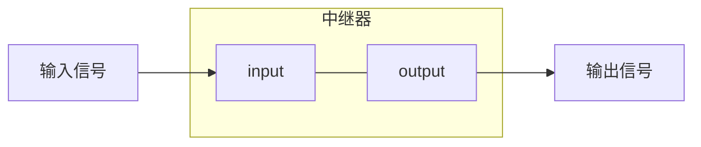
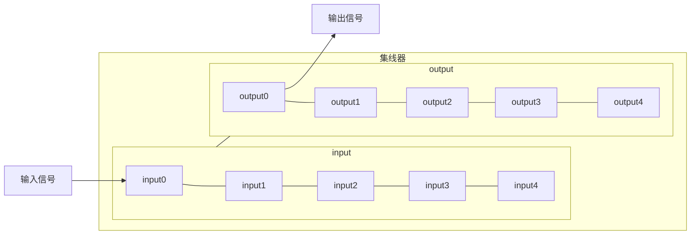

# 物理层－物理层设备
## 中继器
中继器的主要功能是将信号**整形并放大在转发出去**，以消除信号经过一长段电缆后而产生的失真和衰减，使信号的波形和强度达到所需要的要求，进而扩大网络传输的距离。   
中继器有两个端口： 输入＋输出    

中继器是用来扩大网络规模的最简单廉价的互联设备。  
中继器工作在物理层，所以不能连接**两个具有不同速率的局域网**。   
在 `10BASE5 `以太网规范中，互相串联的中继器的个数不能超过4个，而且用4个中继器串联的5段通信介质中只有3段可以挂接计算机，
其余两端只能用作拓展通信范围的链路段，不能挂接计算机。   
## 集线器
集线器(Hub)实质上是一个多端口的中继器。   
他在网络中只起到信号放大和转发作用，目的是**扩大网络的传输范围**，而不具备信号的定向传送能力，即消息传输的方向是固定的，是一个标准的共享式设备。   
hub主要使用双绞线组建共享网络，是从服务器连接桌面的最经济方案。   
使用Hub组网灵活，它把所以节点的通信集中在以其为中心的节点上（**星型网络**），对与节点相连的工作站进行集中管理，
不让出问题的工作站影响整个网络的正常运行，用户的进入与退出也很自由。   

