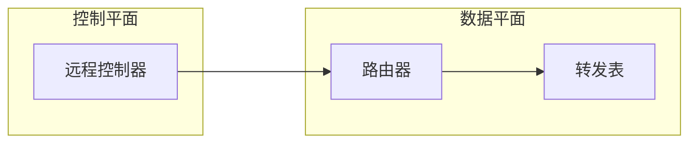

#! https://zhuanlan.zhihu.com/p/627295988
网络层
---

# 网络层－网络层的功能

- [网络层－网络层的功能](#网络层网络层的功能)
  - [异构的网络互联](#异构的网络互联)
  - [路由和转发](#路由和转发)
  - [SDN（软件定义网络） 的基本概念](#sdn软件定义网络-的基本概念)
  - [拥塞控制](#拥塞控制)
  - [网络层](#网络层-1)

互联网在网络层的设计是，向上只提供简单灵活的，无连接的，尽最大努力交付的数据报服务。**这样是的网络比较低廉。**   

## 异构的网络互联

网络互联是将两个以上的的计算机网络，通过一定的方法，用一些中间设备（中继系统）相互连接起来，以构成更大的网络系统。    
网络互联通常是用**路由器**进行互联和路由选择。   
TCP／IP 体系是在网络互联上采用的做法是在网络层采用标准化协议，但相互连接的网络可以是异构的。    

## 路由和转发

路由器的两个任务：  
1. 路由选择   
2. 分组转发   

## SDN（软件定义网络） 的基本概念

控制平面通过控制－数据接口对数据平面上的路由器进行集中控制。   
SDN 提供的接口为北向接口。   
SDN 控制器与转发设备建立双向的会话接口称为南向接口。   
SDN 的优点:     
1. 全局集中式控制和分布式高速转发,既利于控制平面的全局优化,又利于高 自动化工具以编程方式配置。
2. 降低成本,控制和数据平面分离后,尤其是在使用开放的接口协议后,就实现了网络设备的制造与功能软件的开发相分离,从而有效降低了成本。
3. 灵活可编程与性能的平衡,控制和转发功能分离后,使得网络可以由专有的自动化工具以编程方式配置。  

SDN 的问题:   
1. 安全风险,集中管理容易受攻击,如果崩溃,整个网络会受到影响。
2. 瓶颈问题,原本分布式的控制平面集中化后,随着网络规模扩大,控制器可能成为网络性能的瓶颈。性能的网络转发。
   
## 拥塞控制
在通信子网中，因为出现过量的分组而引起网络性能下降的现象称为拥塞。   

> 就是路由器的速率接近链路的带宽，路由器接口缓冲区大小有限，会丢弃很多分组，这样网络的吞吐量会下降很多。   

相比于流量控制，浏览控制强调于**点对点**的传输，控制接受端与发送端的速率，以便接受端来得及接受。  
但是拥塞控制强调于**全局**，一个通信子网的网络传输能力。   
控制方法：   
1. 开环控制
在实现将可能导致网络发生拥塞的情况考虑清楚。   
2. 闭环控制   
采用检测网络系统去检测。  
网络层
---