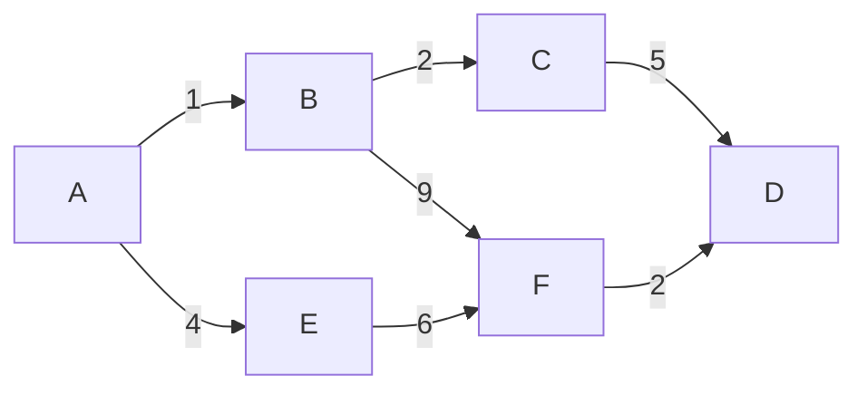

#! https://zhuanlan.zhihu.com/p/627306474
网络层
---
# 网络层－路由算法

- [网络层－路由算法](#网络层路由算法)
  - [静态路由与动态路由](#静态路由与动态路由)
  - [距离－向量路由算法](#距离向量路由算法)
  - [链路状态路由算法](#链路状态路由算法)
  - [层次路由](#层次路由)
  - [网络层](#网络层-1)

## 静态路由与动态路由
- **静态路由算法**   
由网络管理员手工配置路由信息。简便开销较小，适用于小型网络。     
- **动态路由算法**    
通过路由器之间彼此交换消息来自动填充路由表项。有助于流量控制，算法复杂会增加网络的负担，反应太慢会影响网络一致性，太快会引起震荡。      

## 距离－向量路由算法 

[距离－向量路由算法](https://zhuanlan.zhihu.com/p/45062599)  
网络中每一个路由器都要维护一张 矢量表 ，这个 矢量表 中的每一行都记录了从当前位置能到达的目标路由器的最佳出口（接口）和距离（跳数）。

每隔一段时间当前路由器会向所有的邻居节点发送自己的这个表，同时它也会接收每个邻居发来的它们的表。并会将邻居的表和自己的表做一个对比更新。

A 把`A -> B ＝1，A->E=4 ,最短1`发给B，B 收到后与自己的表进行整合更新，B->C 2 B-> F 9,B添加进A发来的信息，逐渐以此类推每个节点会有一个全局的转发表，从而选取最短路径进行路由。   

当网络结构发生变化的时候，各个路由器中的矢量表也会随之动态更新。

## 链路状态路由算法

[链路状态路由算法](https://www.cnblogs.com/Zeker62/p/15046186.html)  
每个路由器将自己的链路状态信息洪泛（flooding）到网络上的所有路由器。
最后，每个路由器都会纸雕整个网络的拓扑结构（LSDB）
每个路由器使用的是最短路径算法计算最短路径，来更新路由表
路由器的链路状态发生变化的时候会继续洪泛自身的链路状态信息到其他的路由器   
计算最短路径，图论。   

首先通过泛洪法，将路由器的消息发给相邻的所有路由器，即在A -> B,B ->C,B->F,这样在B中F收到B的消息，会记录下A->B链路的信息记录下来，以此类推，这样每个节点会逐渐拼接出整个网络的链路状态，之后可以使用最短路径算法路由。   
## 层次路由
按照层次进行路由选择。  
每个自治系统有权决定本系统内应采用何种路由选择协议，如果两个自治系统通信，就需要一种自治系统间的协议来屏蔽这些差异。   

- 内部网关协议   
域内路由选择，常见协议有RIP，OSPF。   
- 外部网关协议
在不同分治系统的路由器间交换路由信息。   
网络层
---