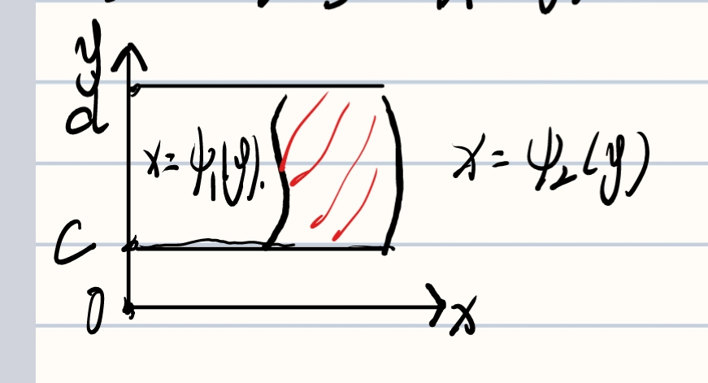
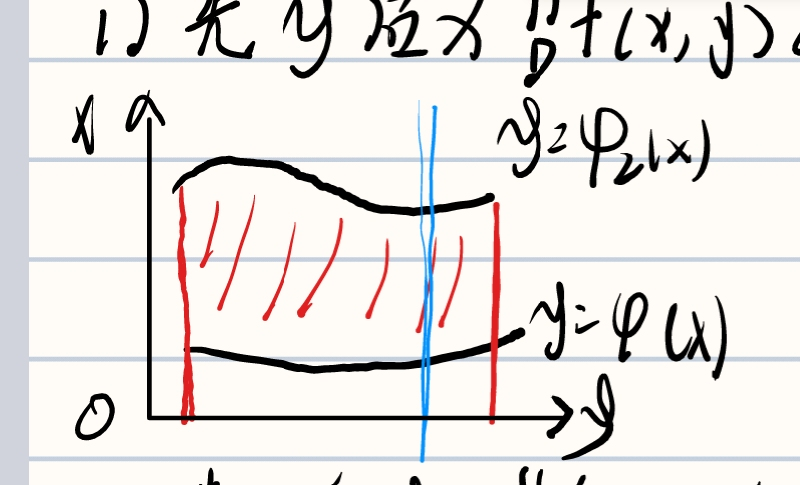

# 二重积分

- [二重积分](#二重积分)
  - [交换积分次序](#交换积分次序)
    - [先x后y](#先x后y)
    - [先y后x](#先y后x)
    - [极坐标系下](#极坐标系下)
  - [二重积分计算](#二重积分计算)
    - [分部积分](#分部积分)

> 填空题 106, 107, 108, 109, 110, 111, 112, 113, 114, 115, 116, 117, 118, 119, 120

## 交换积分次序

### 先x后y

$$
 \displaystyle \int^{y1}_{y2}dy \displaystyle \int^{x_{2}()}_{x_{1}()}f(x)dx
$$

画一个横线，入口下限，出口上限对于x。   
较大的y为上限，较小的为下限。   

### 先y后x

$$
 \displaystyle \int^{x1}_{x2}dx \displaystyle \int^{y_{2}()}_{y_{1}()}f(x)dy
$$

画一竖线，入口为下限，出口为上限。
较小的x为下限，较大的为上限。  

### 极坐标系下

$$
 \displaystyle \int^{\theta_{2}}_{\theta_{2}}d\theta \displaystyle \int^{r_{2}}_{r_{1}}f(x)rdr
$$

## 二重积分计算

**1. 画出积分区域**   
**2. 看对称性**   
**3. 交换积分次序**   

### 分部积分
$$
 \displaystyle \int^{}_{}udv = uv - \displaystyle \int^{}_{}vdu
$$

**积分号中的变量向微分号中转换是：**

$$
 \displaystyle \int^{}_{} -> d 找原函数（求不定积分）
$$
$$
 d -> \displaystyle \int^{}_{} 求导数  
$$
**还需要做的：109，110，111，112，113，115，119，120**