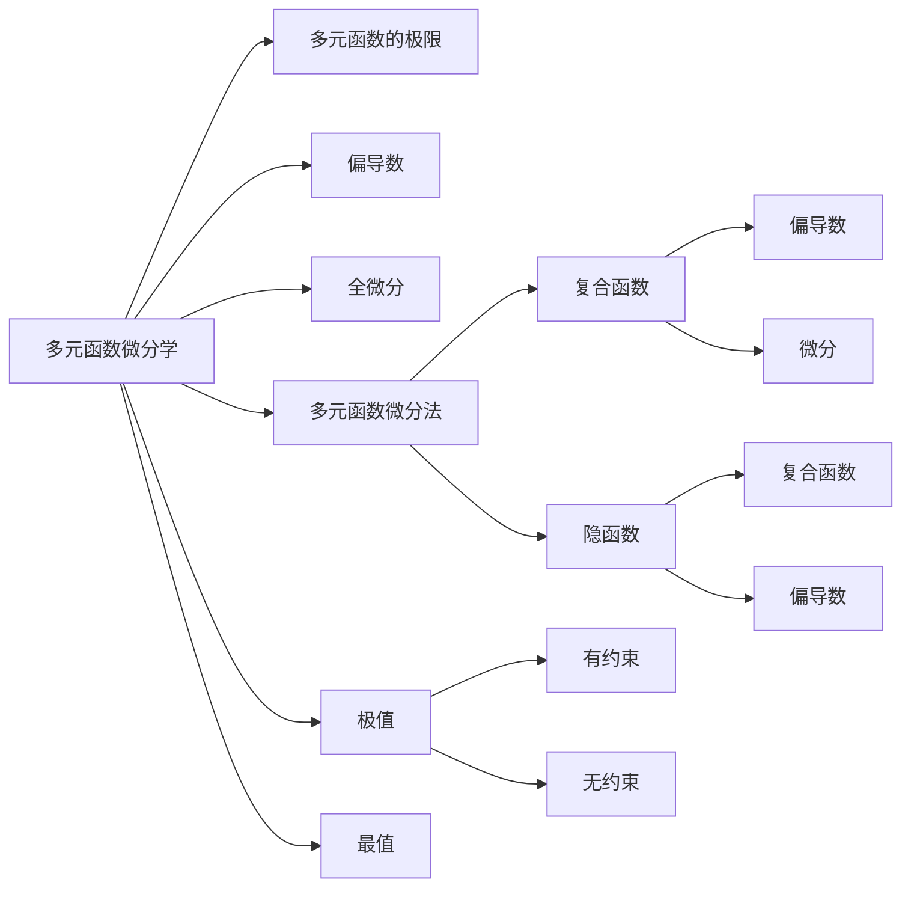

660
---

# 多元函数微分学

> 填空题 序号：85，86，87，88，89，90，91，92，93，84，95，96，98，98，99，100，101，102，103，104，105

- [多元函数微分学](#多元函数微分学)
  - [思维导图](#思维导图)
  - [考点](#考点)
  - [偏导数](#偏导数)
    - [使用链式法则求偏导数](#使用链式法则求偏导数)
  - [全微分](#全微分)
    - [求全微分](#求全微分)
    - [全微分的性质](#全微分的性质)
  - [方法](#方法)
    - [变上限积分的求导法则](#变上限积分的求导法则)
    - [先带后求](#先带后求)
  - [660](#660-1)

## 思维导图


## 考点
**求偏导数（使用链式法则）** 85, 86, 87, 88, 89, 90, 91, 92, 93， 95。   
**变上限积分的求导法则与链式法则求偏导数** 94   
**积分与偏导数** 96   
**全微分的性质** 97, 98, 99   
**求全微分** 100, 101, 102, 103   
**极值与最值** 104, 105   

## 偏导数

求偏导数时，将要求的看成自变量其他都看出常数。   

### 使用链式法则求偏导数

例如：
$$
z = u(1+y) + v(x^2 + y^2)
$$
```c
    z
  u    v
x  y  x  y
```
可找出上图的关系，利用链式法则进行求导。   
$$
\frac{d z}{d u} \times \frac{\partial u}{\partial x} +  \frac{d z}{d v} \times \frac{\partial v}{\partial y}
$$
**对与求$\frac{\partial^2 u}{\partial x \partial y}$ 的问题**  
先求对x的偏导然后再求对y的偏导。   

## 全微分

### 求全微分

$$
dz = \frac{\partial z}{\partial x} dx + \frac{\partial z}{\partial y} dy
$$

### 全微分的性质
$\displaystyle \lim^{x \to 0}_{y \to 0}{\frac{\Delta z - (A\Delta x + B\Delta y)}{\sqrt{(\Delta x)^2 + (\Delta y)^2}}} = 0$

## 方法

### 变上限积分的求导法则 
$$
 \displaystyle \int^{x}_{a}{f(x)}dx = \displaystyle \int^{x}_{a}{f(t)}dt
$$
$$
\Phi(x) = \displaystyle \int^{x}_{a}{f(t)}dt
$$
$$
\displaystyle \int^{x}_{a}{f(t)}dt = f(\Phi(x))\Phi'(x) - f(\Psi(x))\Psi'(x)
$$

### 先带后求
可以先将已知的数带入，方便进行后续的计算。   

还需要做的: **85,88,90,92,93,94,96,97,98,99,100,103,105**

660
---