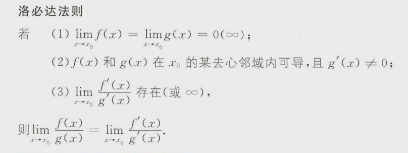
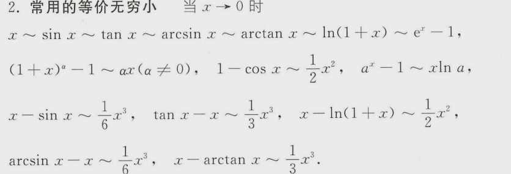
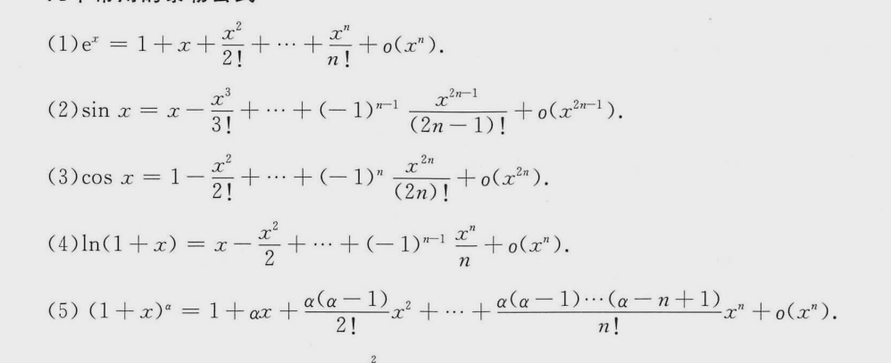

# 极限

- [极限](#极限)
  - [极限的性质与概念](#极限的性质与概念)
    - [数列极限](#数列极限)
    - [函数极限](#函数极限)
    - [性质](#性质)
  - [求极限](#求极限)
    - [洛必达法则](#洛必达法则)
    - [等价无穷小替换](#等价无穷小替换)
    - [泰勒公式](#泰勒公式)
    - [夹逼法](#夹逼法)

> 选择题： 121, 122, 123, 124, 125, 126, 127, 128, 129, 130, 131, 132, 133, 134, 135, 136, 137, 138, 139, 140  

> 填空题：3，4，5，6，7，8，9，10，11，12，13，14，15，16，17，18，19，20，21

## 极限的性质与概念

### 数列极限

$$
\lim\limits_{x \to 0}x_{n} = a \leftrightarrow \lim\limits_{k \to \infin}x_{2k - 1} = \lim\limits_{k \to \infin}x_{2k} = a
$$

数列的极限是否存在，如果存在极限值等于多少与数列的**前有限项**无关。

### 函数极限

极限$\lim\limits_{x \to x_{0}}f(x)$是否存在，如果存在极限与f(x)在$x=x_{0}$处有没有定义，如果有定义函数值等于多少无关，只与$x=x_{0}$的去心临域$\dot{U}(x_{0}, \delta)$函数值有关；而要使$\lim\limits_{x \to x_{0}}f(x)$存在，$f(x)$必须在$x=x_{0}$的某去心临域内处处有定义。  

$\lim\limits_{x \to x_{0}}f(x)$存在的**充要条件**是左右极限存在且相等。   

### 性质

如果数列$x_{n}$收敛，那么数列$x_{n}$一定有界     
若$\lim\limits_{x \to x_{0}}f(x)$存在，则f(x)在$x_{0}$某去心邻域有界(即局部有界).     
保号性  
对于数列：如果A>0,那么可以保证N之后的元素大于0，反之可以保证N后的元素小于0。   
对于函数，如果A>0，那么可以保证临域内的函数值大于0，反之可以保证小于0。   

$$
\lim\limits_{}f(x)=A \leftrightarrow f(x) = A + \alpha(x)
$$

存在 +- 不存在 **不存在**   
存在 */ 不存在 **不存在**   
不存在 +- 不存在 **不一定**    
不存在 */ 不存在 **不一定**   

## 求极限

### 洛必达法则

对分子分母进行求导。   

### 等价无穷小替换

高阶 0  
低阶 $\infin$
同阶 C    
等价 1  
无穷小的阶  
$$
\lim\limits_{}\frac{\alpha(x)}{\beta(x)} = C
$$
有限个无穷小的和仍是无穷小.   
有限个无穷小的积仍是无穷小.   
无穷小量与有界量的积仍是无穷小.   

### 泰勒公式

### 夹逼法

**还需要做的：121，125，123，127，126，130，133，135，136，138，5，6，8，12，13，15，18，19，20，21**